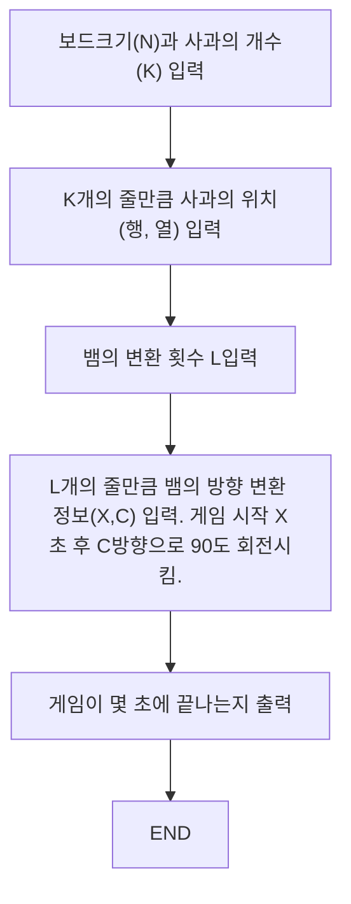

# gitBlog

```mermaid
graph TD;
    A["보드크기(N)과 사과의 개수(K) 입력"]-->B;
    B["K개의 줄만큼 사과의 위치(행, 열) 입력"]-->C;
    C["뱀의 변환 횟수 L입력"]-->D;
    D["L개의 줄만큼 뱀의 방향 변환 정보(X,C) 입력. 게임 시작 X초 후 C방향으로 90도 회전시킴."]-->E;
    E["게임이 몇 초에 끝나는지 출력"]-->END;
```